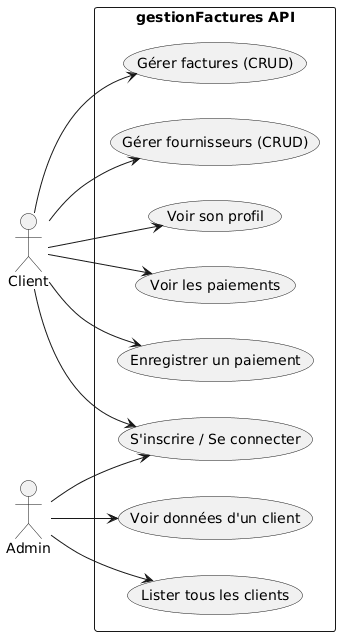
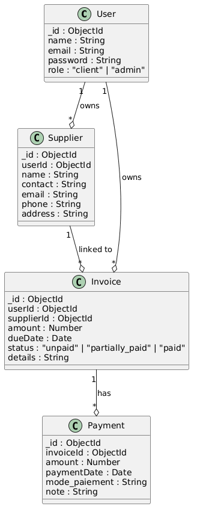
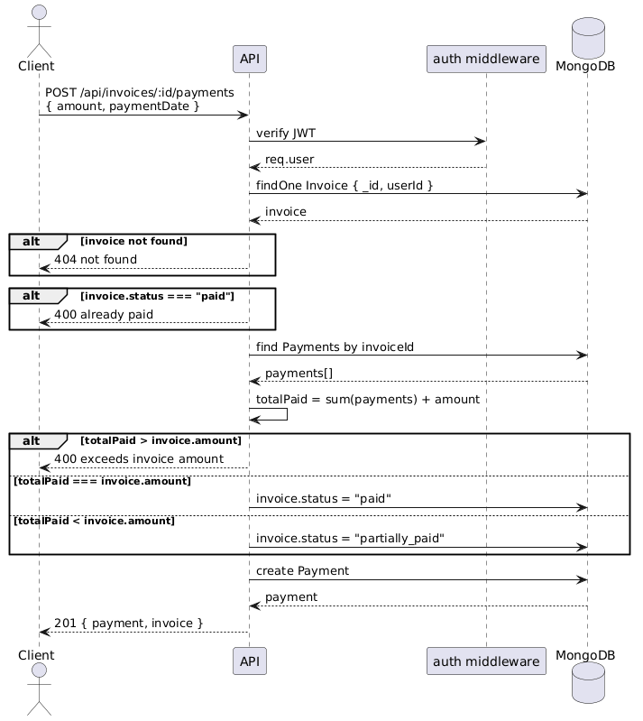

# gestionFactures — Smart Invoice & Payment Tracking API

API backend sécurisée pour la gestion de factures fournisseurs, avec authentification JWT, suivi des statuts de paiement et isolation des données par client.

## Stack technique

- **Node.js** + **Express**
- **MongoDB** + **Mongoose**
- **JWT** (jsonwebtoken) + **bcrypt**
- **dotenv**

## Installation

```bash
git clone https://github.com/anassk01/gestionFactures.git
cd gestionFactures
npm install
```

Créer un fichier `.env` à la racine :

```
PORT=4001
MONGO_URI=mongodb://localhost:27017/gestionFactures
JWT_SECRET=your_secret_key
```

Démarrer le serveur :

```bash
npm start
```

## Routes API

Toutes les routes protégées nécessitent le header : `Authorization: Bearer <token>`

### Authentification

| Méthode | Route | Auth | Description |
|---------|-------|------|-------------|
| POST | `/api/auth/register` | Non | Inscription d'un nouveau client |
| POST | `/api/auth/login` | Non | Connexion — retourne un token JWT |
| GET | `/api/auth/me` | Oui | Profil de l'utilisateur connecté |

### Fournisseurs

| Méthode | Route | Description |
|---------|-------|-------------|
| POST | `/api/suppliers` | Créer un fournisseur |
| GET | `/api/suppliers` | Lister ses fournisseurs |
| GET | `/api/suppliers/:id` | Consulter un fournisseur |
| PUT | `/api/suppliers/:id` | Modifier un fournisseur |
| DELETE | `/api/suppliers/:id` | Supprimer un fournisseur |

### Factures

| Méthode | Route | Description |
|---------|-------|-------------|
| POST | `/api/invoices` | Créer une facture (`supplierId`, `amount`, `dueDate`) |
| GET | `/api/invoices` | Lister ses factures |
| GET | `/api/invoices/:id` | Consulter une facture |
| PUT | `/api/invoices/:id` | Modifier une facture (si non totalement payée) |
| DELETE | `/api/invoices/:id` | Supprimer une facture (si aucun paiement associé) |

### Paiements

| Méthode | Route | Description |
|---------|-------|-------------|
| POST | `/api/invoices/:id/payments` | Enregistrer un paiement (`amount`, `paymentDate`) |
| GET | `/api/invoices/:id/payments` | Lister les paiements d'une facture |

### Logique des statuts

Le statut de chaque facture est mis à jour automatiquement après chaque paiement :

- `unpaid` — aucun paiement enregistré
- `partially_paid` — paiement partiel (total < montant facture)
- `paid` — total des paiements égal au montant de la facture

## Diagrammes UML

### Diagramme de cas d'utilisation (Use Case)



### Diagramme de classes (Class Diagram)



### Diagramme de séquence (Sequence Diagram)


